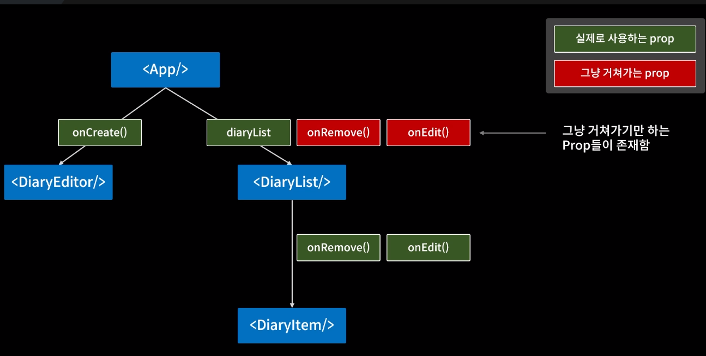
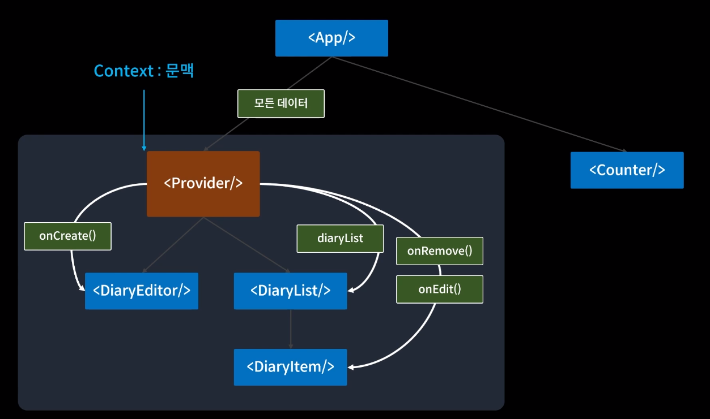

onRemove, onEdit 과 같이 부모 컴포넌트가 실질적으로 사용하지 않는 props를 전달하는 중간 컴포넌트가 많이 생긴다면 코드 작성 및 수정에 악영형을 끼친다.

이러한 상황을 `props drilling`이라고 한다.

<br>

`props drilling` 문제를 해결하기 위해 `Context`를 이용한다.



<br>

사용방법

```javascript

// Context 생성
const MyContext = React.createContext(defaultValue);

// Context Provider를 통한 데이터 공급
<MyContext.Provider value={전역으로 전달하고자하는 값}>
  // context안에 위치할 자식 컴포넌트들
</MyContext.Provider>
```
