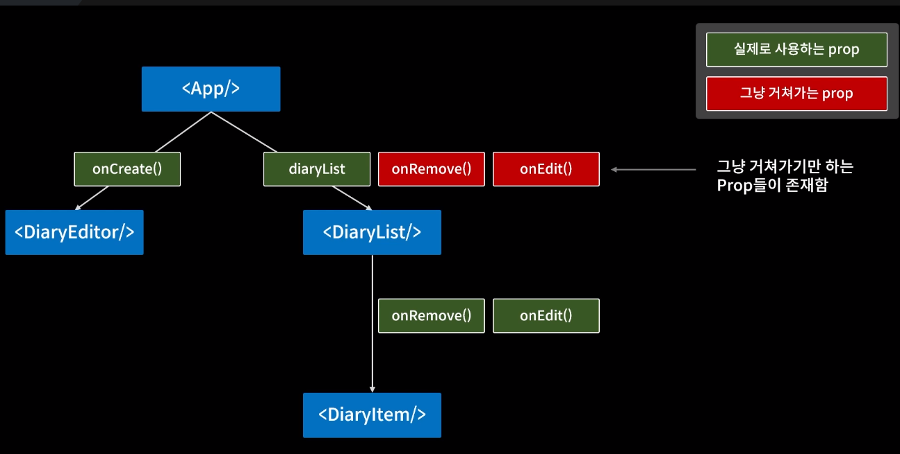
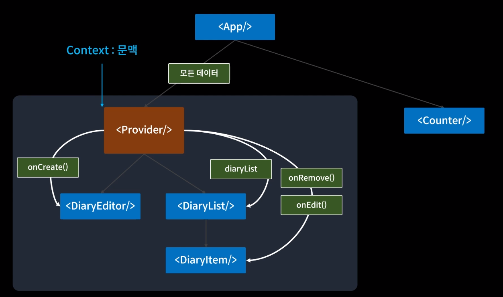

onRemove, onEdit 과 같이 부모 컴포넌트가 실질적으로 사용하지 않는 props를 전달하는 중간 컴포넌트가 많이 생긴다면 코드 작성 및 수정에 악영형을 끼친다.

이러한 상황을 `props drilling`이라고 한다.

<br>

`props drilling` 문제를 해결하기 위해 `Context`를 이용한다.



<br>

사용방법

```javascript

// Context 생성
const MyContext = React.createContext(defaultValue);

// Context Provider를 통한 데이터 공급
<MyContext.Provider value={전역으로 전달하고자하는 값}>
  // context안에 위치할 자식 컴포넌트들
</MyContext.Provider>
```

<br>

프로젝트에 적용하기

```javascript
// data를 Context를 이용하여 props로 전달하기 위해 생성함
export const DiaryStateContext = React.createContext();
// onCreate, onRemove, onEdit를 Context를 이용하여 props로
export const DiaryDispatchContext = React.createContext();

const App = () => {

  ...

  // 아래와 같이 함수 객체 형태로 만들면 App.js가 랜더링시 객체에 명시된 함수가 같이 랜더링이 되어 불필요한 랜더링이 늘어난다.
  // const dispatches = {
  //   onCreate, onRemove, onEdit
  // }

  // useMemo를 사용하여 함수의 렌더링을 막아준다.
  const memoizedDispatches = useMemo(() => {
    return { onCreate, onRemove, onEdit };
  }, []);

  return (
    // Provider 컴포넌트로 App을 감싸준다.
    // 렌더링 되지않는 함수의 context를 아래로 배치시켜준다.
    <DiaryStateContext.Provider value={data}>
      <DiaryDispatchContext.Provider value={memoizedDispatches}>
        <div className="App">
          <DiaryEditor onCreate={onCreate} />
          <div>전체 일기 : {data.length}</div>
          <div>기분 좋은 일기 개수 : {goodCount}</div>
          <div>기분 나쁜 일기 개수 : {bedCount}</div>
          <div>기븐 좋을 일기 비율 : {goodRatio}</div>
          <DiaryList onRemove={onRemove} onEdit={onEdit} />
        </div>
      </DiaryDispatchContext.Provider>
    </DiaryStateContext.Provider>
  );
};
```

```javascript
// DiaryList.js
const DiaryList = () => {
  // DiaryStateContext로 전달받은 data를 사용하여 list를 뿌려준다.
  const diaryList = useContext(DiaryStateContext);

  ...
}
```

```javascript
// DiaryEditor.js
const DiaryEditor = () => {

  // context로 전달된 onCreate 메서드를 useContext hook으로 받아 사용한다.
  const { onCreate } = useContext(DiaryDispatchContext);

  ...
}
```
